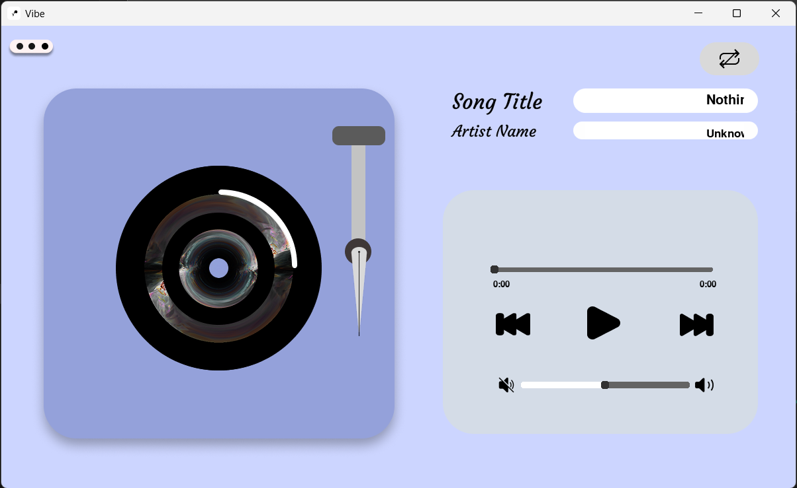

# Vibe 🎵


[About](#about) | [Features](#features) | [Installation](#installation) | [Testing](#testing) | [Contributing](#contributing) | [License](#license)


**Vibe** is a lightweight and fast MP3 music player built with **Python** and **Pygame**.  
It features a smooth UI, interactive controls, sliders, a platter and a vinyl-style needle animation for a smooth music experience.

---

## About

Vibe provides a visually appealing and interactive music playback experience.  
It is designed for personal use or for learning Python GUI development with Pygame.


## Features

- Play, pause, next, and previous track controls
- Loop modes: one, all, off
- Volume and progress sliders
- Custom needle animation and a rotating platter for vinyl-style playback
- Supports `.mp3` audio files
- Fully tested with `pytest`

---

## Project Structure
```
Vibe/
│ main.py # Entry point
│ player.py # Main player window class
│ audio.py # Audio handling logic
│ buttons.py # UI button logic
│ slider.py # Slider handling
│ settings.py # Configuration and settings
│ requirements.txt # Python dependencies
│ LICENSE # MIT License
│
├───Images/ # UI assets
└───tests/ # Automated and manual tests
```

## Screenshots


*Main window of Vibe showing controls and vinyl-style needle.*


## Installation

### 1. Clone the repository:

```bash
git clone https://github.com/A0X0P/Vibe.git
cd Vibe

```

### 2. (Optional) Create a virtual environment:
```bash
python -m venv venv
source venv/bin/activate   # Linux/macOS
venv\Scripts\activate      # Windows
```

### 3. Dependencies

Vibe requires the following Python packages:

- pygame==2.6.1
- mutagen==1.47.0
- pytest>=9.0.1 (for testing)
- pytest-cov>=7.0.0 (for coverage)
- pytest-mock>=3.15.1 (for mocking in tests)

You can install them all at once with:
```bash
pip install -r requirements.txt
```

### 4. Run the player:
```bash
python main.py
```
OR if installed as a package with console script:
```bash
pip install .
vibe
```

## Testing
Run automated tests with:
```bash
pytest
```
Generate a coverage report:
```bash
pytest --cov=.
```

## Contributing

Contributions are welcome! You can help by:

- Reporting bugs or suggesting new features via GitHub Issues
- Submitting pull requests for bug fixes or improvements
- Improving documentation, README, or code comments

Please make sure your code follows the existing style and includes tests where appropriate.

## License

This project is licensed under the [MIT License](LICENSE).
